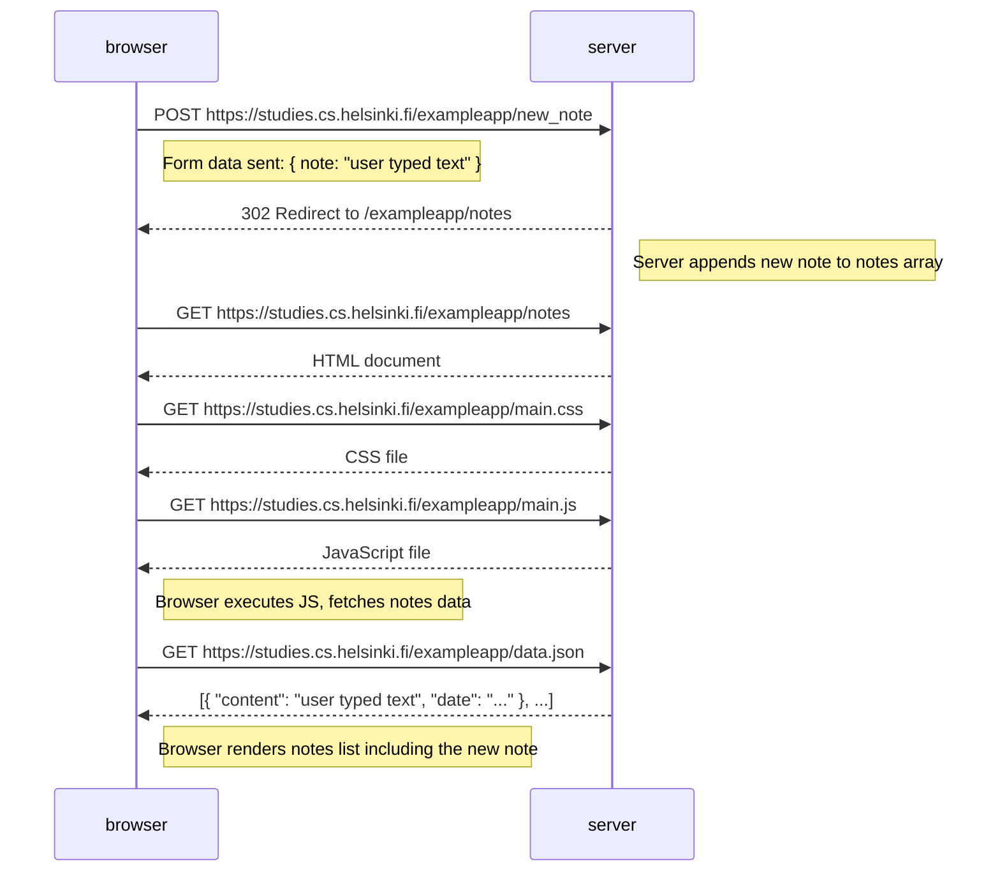

```mermaid
sequenceDiagram
    participant browser
    participant server

    browser->>server: POST https://studies.cs.helsinki.fi/exampleapp/new_note
    Note right of browser: Form data sent: { note: "user typed text" }

    server-->>browser: 302 Redirect to /exampleapp/notes
    Note right of server: Server appends new note to notes array

    browser->>server: GET https://studies.cs.helsinki.fi/exampleapp/notes
    server-->>browser: HTML document

    browser->>server: GET https://studies.cs.helsinki.fi/exampleapp/main.css
    server-->>browser: CSS file

    browser->>server: GET https://studies.cs.helsinki.fi/exampleapp/main.js
    server-->>browser: JavaScript file

    Note right of browser: Browser executes JS, fetches notes data

    browser->>server: GET https://studies.cs.helsinki.fi/exampleapp/data.json
    server-->>browser: [{ "content": "user typed text", "date": "..." }, ...]

    Note right of browser: Browser renders notes list including the new note
```
